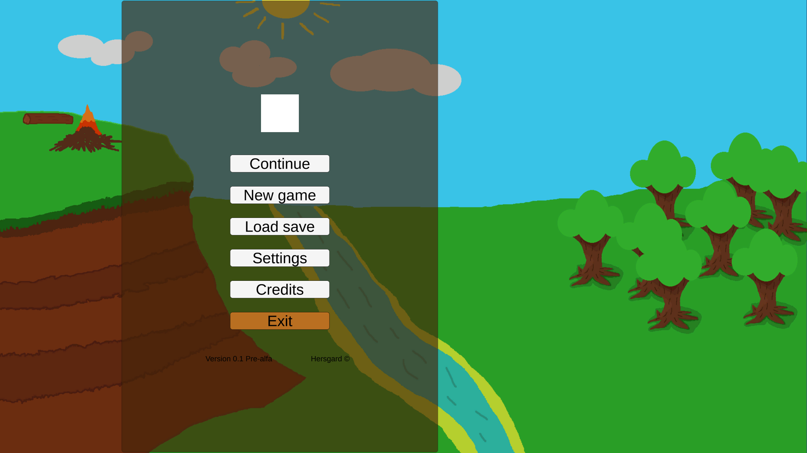
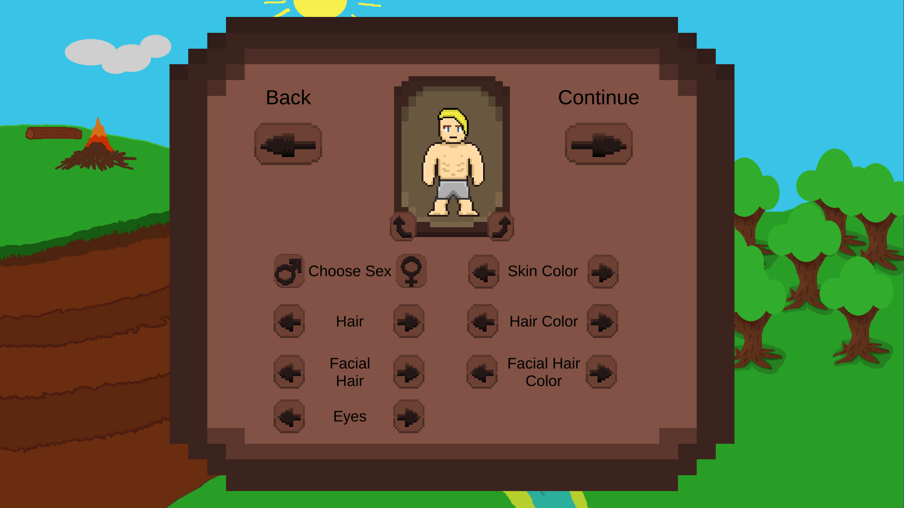
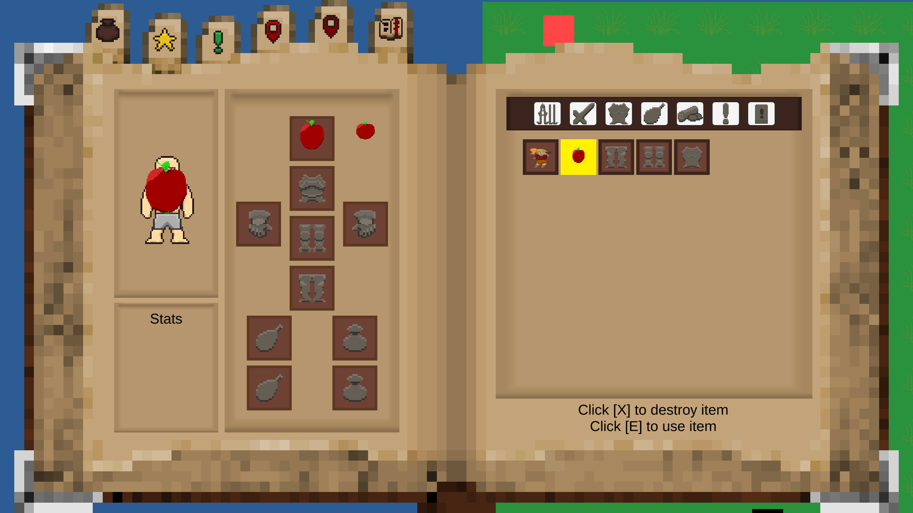
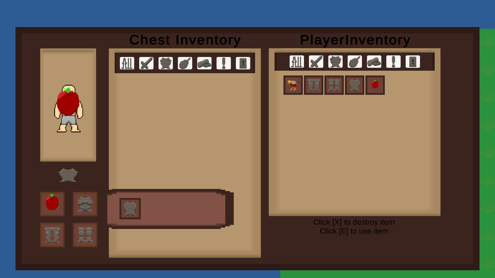
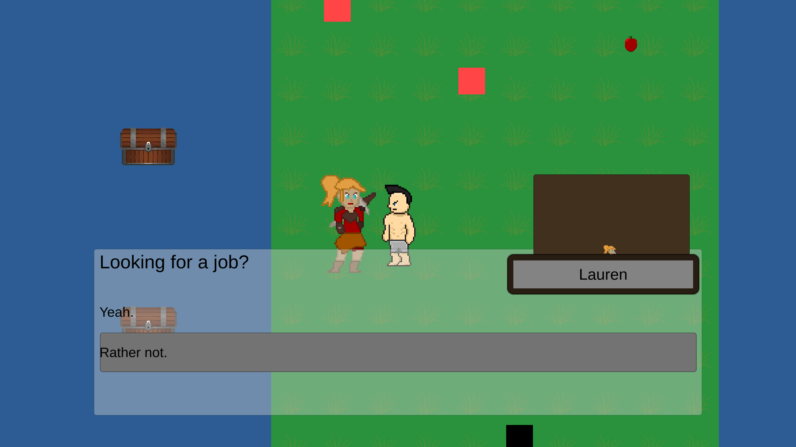
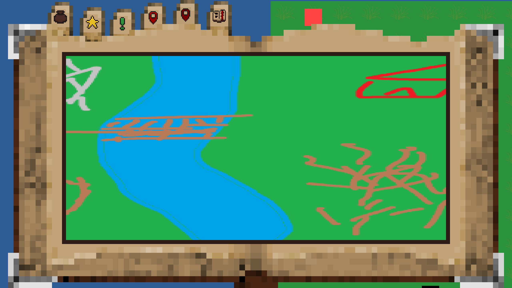
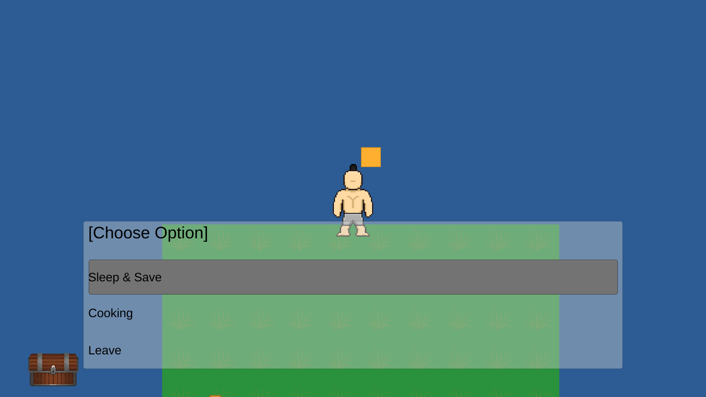

# HERSGARD

Hergard is an open world RPG fantasy game made in Unity.
Game uses Ink for dialogue system.

## Prepared Systems

- Player Movement
- Character Creator
- Player UI
- Dialogue
- Inventory
- Saving

## Keybindings

### Keyboard

#### Player

- movement - wsad or arrow keys

- run - Shift

- interact - e

- roll - Space

- dodge - Ctrl

#### UI

- open inventory - i

- open menu - Escape

- open map - m

- open quests - k

- open skills - l

- open bestiary - o

- open inventory - i

#### Dialogue

- skip dialogue - Space

- choose dialogue option - Enter 

#### Inventory

- select item - mouse left btn

- pass item to/ from chest or equip item - right click

- delete item - x

- use item - e

### Gamepad ( Xbox Controller )

#### Player
- movement - left stick

- interact - Y

- run - right trigger

- roll - left trigger

#### UI

- open inventory - menu btn

- open menu - view btn

- open map - right bumper

#### Dialogue

- skip dialogue - X

- choose dialogue option - A 

#### Inventory

- select item - A

- pass item to/ from chest or equip item - X

- delete item - B

- use item - Y

### Note

Gamepad bindings aren't ready yet.

### Work In Progress

## Screens from the game

